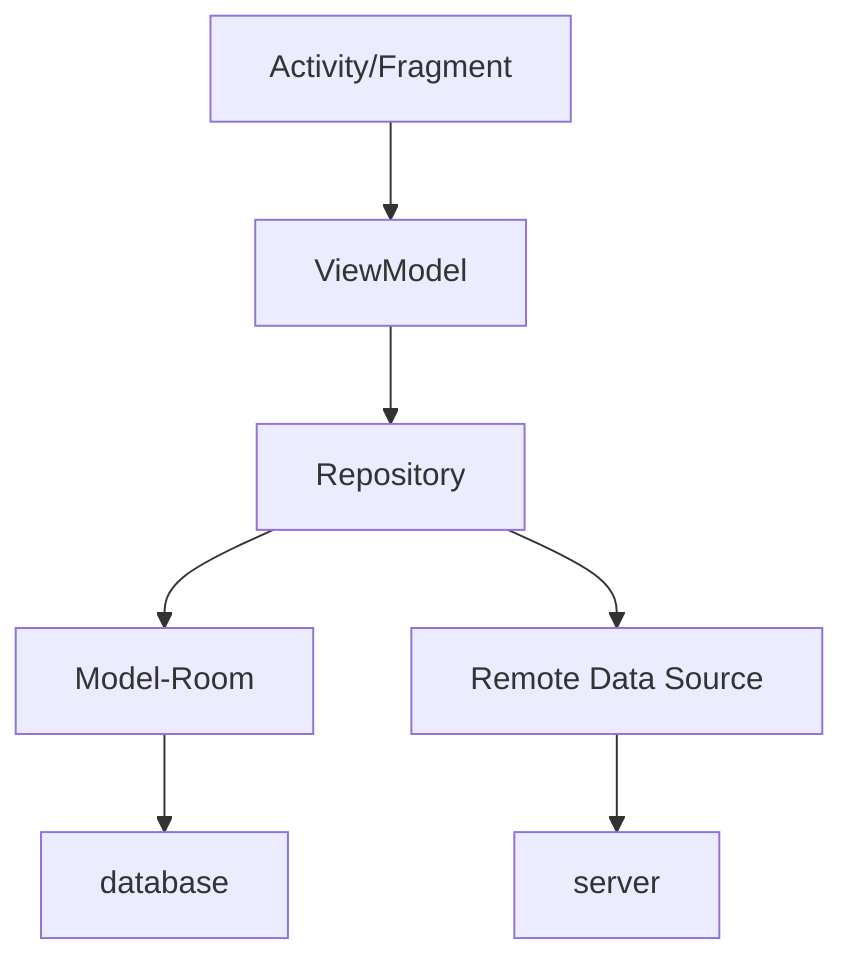
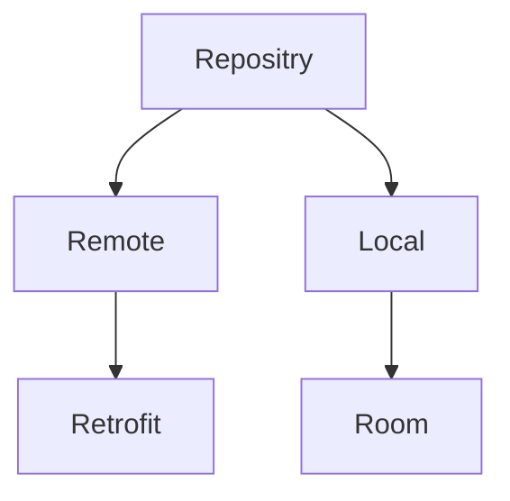
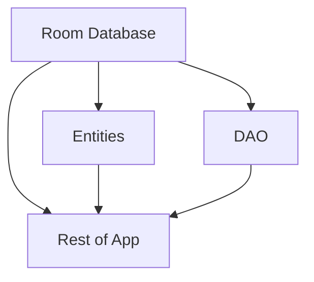

[TOC]

# Introduction

LearningManagementSystem is a platform that provides courses to students. In our app, students can explore courses, study and buy their classes to learn by recharging fake money. Pay attention, both the server and client are designed by two groups together, our group focus mainly on the server, the other group focus mainly on the android app, for time limited, it's impossible for us(4 people) to deign both of the   app  and server, so we made up a larger group by ourselves, so there might be two similar android projects,for we used the same server(so the data source will be  same) and same technology on android , same design style and same app functions. here is the server Github address https://github.com/zhouzhouyou/ELearningServer.git, and our group have already put it on the Internet.

# Brief Design

The app can be divided into these main functions:

- Explore All Courses

- Explore Registered Courses

- Calendar

# Architecture

# Activity/Fragment

In our architecture, there is only one main activity. All other views are switched in the activity.
Main navigation method is use navigation drawer.

## Home

### Category

In order to help student choose specific type of courses, we can divide all courses into different categories,

Then students can get what they want by a 

### Recommend

Show recommend courses to students.

## Course

Show courses’ information, register and study.

## My Courses

Show courses belong to you.

## Calendar

Show the courses you will take today.

## Authentication

### Profile

Show user’s profile and edit.

If not authenticated, navigate to login.

### Login

Login to account.

If press back, navigate to home.

### Register

#### User Password

input user’s account and password.

## Setting

### change language

# ViewModel

> The [`ViewModel`][ViewModel] class is designed to store and manage UI-related data in a lifecycle conscious way. The [`ViewModel`][ViewModel] class allows data to survive configuration changes such as screen rotations. 

ViewModel can store some `LiveData`, so activities and fragments can observe the data change and do UI or other operations, just like the Observe Pattern.

## `CourseViewModel`

handle CRUD of courses.

## `UserViewModel`

handle CRUD if user.

## `RegistrationViewModel`

handle Registration of user.

## `LoginViewModel`

handle Login of user.

## `CalendarViewModel`

handle lessons of current month.

# Repository

## Model-Room

> Room provides an abstraction layer over SQLite to allow fluent database access while harnessing the full power of SQLite. 

Just like mybatis with Spring, Room help me reduce code to CRUD.
	

## Remote Data Source

Retrofit

[ViewModel]: https://developer.android.com/reference/androidx/lifecycle/ViewModel.html

